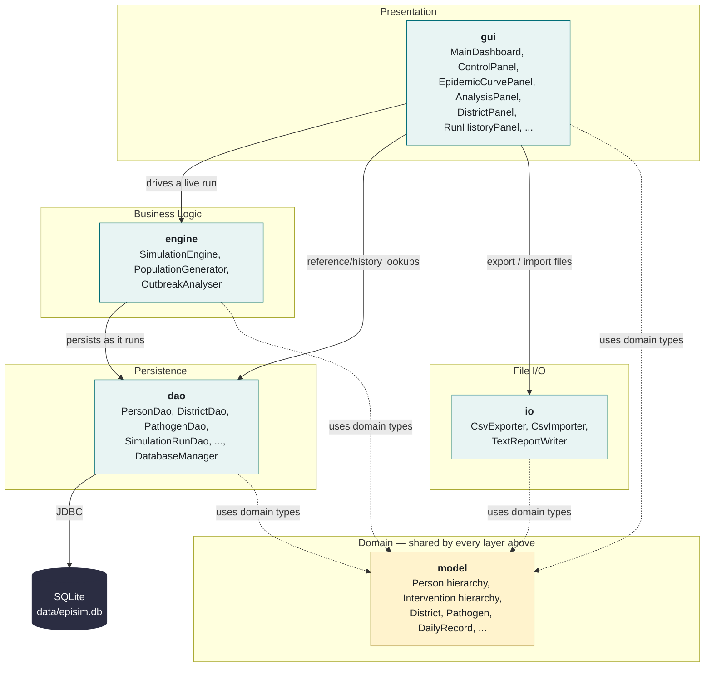

# Architecture Diagram — Package-Level Dependencies

This is a **layered dependency diagram**, not a class diagram — it shows which packages depend on which,
to demonstrate separation of concerns. For member-level detail see
[`class-diagram.md`](class-diagram.md) (domain model) and [`database-design.md`](database-design.md)
(persistence schema).

Every edge below was verified against the actual `import` statements in the source, not assumed from the
package layout. See "How this was verified" at the bottom.



**Solid arrows** = "calls into" at runtime (the operational pipeline). **Dashed arrows** = "imports domain
types from" (`model` is a shared vocabulary every layer reads/writes, not a step in the pipeline).

## The deliberate decision: `model` is persistence-agnostic and UI-agnostic

No class in `com.episim.model` imports anything from `com.episim.dao`, `com.episim.gui`, or
`com.episim.engine`. Every domain object — `Person` and its subclasses, `Intervention` and its
subclasses, `District`, `Pathogen`, `DailyRecord`, `SimulationRun` — is a plain Java object that knows
nothing about SQLite, JDBC, `ResultSet`, Swing, or the simulation loop.

This is deliberate, not incidental:

- **`dao` depends on `model`, never the reverse.** Each DAO's `mapRow(ResultSet)` builds domain objects
  from query results — the domain object itself has no idea it came from a database row. A `Person`
  built by hand in a unit test and a `Person` reconstructed by `PersonDao.mapRow()` are indistinguishable
  to any code that receives one.
- **`gui` depends on `model`, never the reverse.** A `DistrictCard` reads `district.getResidents().size()`
  — `District` has no `paint()` method, no `Color` awareness beyond what `HealthState` itself carries for
  chart rendering, and no reference to any Swing type.
- **Consequence for testability**: `PersonTransitionTest` and `DistrictTest` construct domain objects
  directly and assert on their behaviour with zero database or GUI setup — no mocking required, because
  there is nothing to mock. Swap SQLite for a different store, or Swing for a different UI toolkit, and
  the entire `model` package is untouched.

## Why `gui` also reaches `dao` directly

The arrow from `gui` to `dao` isn't a layering violation — it's two genuinely different needs. Driving a
*live simulation* always goes through `engine.SimulationEngine`, which owns the transactional
start/flush/finalise persistence sequence. But `MainDashboard` (loading the pathogen list at startup) and
`RunHistoryPanel` (querying `v_run_summary`, deleting a run) are read/administrative operations on data
that already exists — routing those through a `SimulationEngine` that doesn't exist yet (no run is in
progress) would be artificial. Both paths still only ever touch `model` objects, never raw SQL, at the
call site.

## A minor wrinkle, noted rather than hidden

`util.AppConfig` imports `io.ReportIoException` (to report a `config.properties` read/write failure using
the same unchecked exception type `io` already uses) — a narrow edge from `util` back into `io`. It's
one exception class, not a dependency on any of `io`'s actual CSV/text logic, so it doesn't compromise
`io`'s own layering (`io` still only depends on `model` and `util`). It's left out of the diagram above to
keep the diagram focused on the load-bearing edges, but it's real and worth naming here rather than
quietly ignoring it.

## How this was verified

Before drawing this diagram, every edge was checked directly against the source rather than assumed:

```
grep -r "^import com\.episim\.(dao|gui|engine)" src/main/java/com/episim/model    → no matches
grep -r "com\.episim\.(dao|gui|engine)"          src/main/java/com/episim/model    → no matches (fully-qualified references too)
grep -r "^import com\.episim\.(gui|engine|dao)"  src/main/java/com/episim/io       → no matches
grep -r "^import com\.episim\.(gui|engine|io)"   src/main/java/com/episim/dao      → no matches
grep -r "^import com\.episim\.dao"               src/main/java/com/episim/engine   → SimulationEngine.java (6 DAOs)
grep -r "^import com\.episim\.dao"               src/main/java/com/episim/gui      → MainDashboard.java, RunHistoryPanel.java
grep -r "^import com\.episim\.io"                src/main/java/com/episim/gui      → AnalysisPanel.java (only)
```
