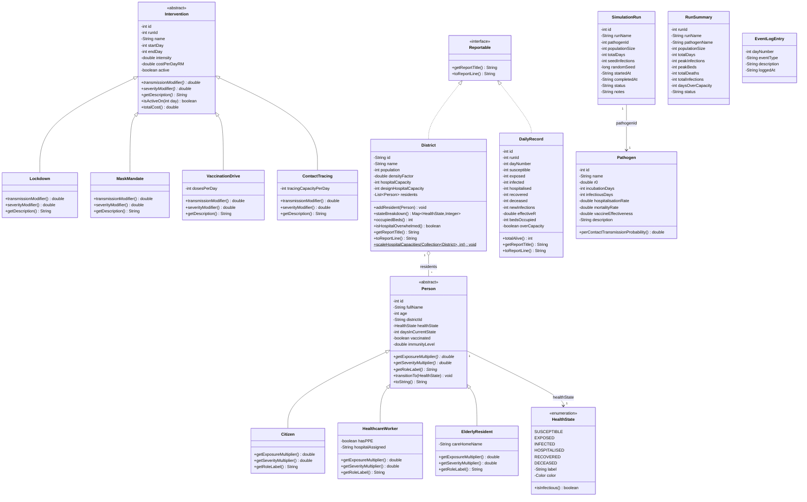

# Class Diagram — `com.episim.model`

The full domain model hierarchy: two parallel abstract-class hierarchies (`Person`, `Intervention`)
demonstrating inheritance and polymorphism, one shared interface (`Reportable`) implemented by two
otherwise-unrelated classes demonstrating interface polymorphism, one enum carrying behaviour, and the
supporting value/DTO classes used by persistence and the GUI.

## Notes on the design

- **Two parallel abstract hierarchies** (`Person`/`Intervention`) are the two required abstraction
  points: each defines abstract methods that every concrete subclass must implement differently
  (`getExposureMultiplier()`/`getSeverityMultiplier()`/`getRoleLabel()`; `transmissionModifier()`/
  `severityModifier()`/`getDescription()`), while sharing concrete behaviour in the base class
  (`transitionTo()`, `isActiveOn()`, `totalCost()`).
- **`Reportable`** is implemented by `District` and `DailyRecord` — two classes with nothing else in
  common — so that `TextReportWriter` can loop over a single `List<Reportable>` mixing both kinds and
  call `toReportLine()` polymorphically without any `instanceof` check.
- **`SimulationEngine`** (in `com.episim.engine`, not shown here — this diagram is the `model` package
  only) holds `List<Person>` and `List<Intervention>` and only ever programs against the abstract
  superclass references; the concrete subclass behaviour is resolved at runtime.
