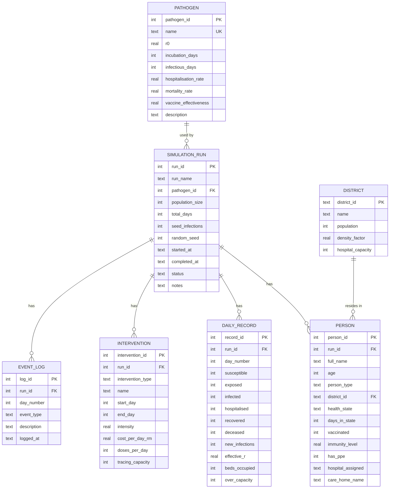

# Database Design

EpiSim persists to an embedded SQLite database at `data/episim.db`, created and seeded automatically by
`DatabaseManager.initialise()` from `src/main/resources/schema.sql` on first launch. `PRAGMA foreign_keys
= ON` is executed on every connection (SQLite disables FK enforcement per-connection by default), so the
`ON DELETE CASCADE` relationships below are genuinely enforced, not just documented intent.

## Entity-relationship overview



## Tables

### `pathogen` — reference data

The diseases available to simulate. Seeded with four profiles (COVID-19-like, seasonal influenza,
measles, a hypothetical "Novel Pathogen X") and never modified by the app at runtime.

| Column | Type | Purpose |
|---|---|---|
| `pathogen_id` | `INTEGER PK AUTOINCREMENT` | Surrogate key |
| `name` | `TEXT UNIQUE NOT NULL` | Display name; uniqueness prevents accidental duplicate seeding |
| `r0` | `REAL` | Basic reproduction number |
| `incubation_days` | `INTEGER` | Days spent `EXPOSED` before becoming `INFECTED` |
| `infectious_days` | `INTEGER` | Days spent infectious (`INFECTED`/`HOSPITALISED`) before resolving |
| `hospitalisation_rate` | `REAL` | Daily probability of hospitalisation while infected |
| `mortality_rate` | `REAL` | Probability of death on resolution |
| `vaccine_effectiveness` | `REAL` | Immunity conferred to a vaccinated person |
| `description` | `TEXT` | Free-text notes |

### `district` — reference data

The four simulated geographic areas. `population` and `hospital_capacity` here are **design values**
sized against a combined design population of 10,000 — `SimulationEngine`/`District.
scaleHospitalCapacities()` rescale `hospital_capacity` in memory to whatever population size a given run
actually configures; this table's own row is never rewritten.

| Column | Type | Purpose |
|---|---|---|
| `district_id` | `TEXT PK` | Natural key, e.g. `"KL-CENTRAL"` |
| `name` | `TEXT` | Display name |
| `population` | `INTEGER` | Design population (proportional weight for population generation) |
| `density_factor` | `REAL` | Multiplier on transmission risk |
| `hospital_capacity` | `INTEGER` | Design bed count |

### `simulation_run` — one row per run

| Column | Type | Purpose |
|---|---|---|
| `run_id` | `INTEGER PK AUTOINCREMENT` | Surrogate key |
| `run_name` | `TEXT` | User/auto-generated label |
| `pathogen_id` | `INTEGER FK → pathogen` | Which pathogen this run used |
| `population_size`, `total_days`, `seed_infections`, `random_seed` | — | The configuration the run was launched with (random_seed makes it reproducible) |
| `started_at` | `TEXT` | Defaults to `datetime('now','localtime')` on insert |
| `completed_at` | `TEXT` | Set when the run finishes or is aborted |
| `status` | `TEXT` | `RUNNING` \| `COMPLETED` \| `ABORTED` |
| `notes` | `TEXT` | Free text |

### `person` — one row per simulated individual per run

The polymorphic `Person` hierarchy is stored in a single table with a `person_type` discriminator column
and nullable subclass-specific columns (`has_ppe`/`hospital_assigned` for `HealthcareWorker`,
`care_home_name` for `ElderlyResident`) — `PersonDao.mapRow()` reconstructs the correct concrete subclass
from `person_type` on the way back out.

| Column | Type | Purpose |
|---|---|---|
| `person_id` | `INTEGER PK AUTOINCREMENT` | Surrogate key |
| `run_id` | `INTEGER FK → simulation_run ON DELETE CASCADE` | Nullable — a standalone `insert()` (not part of a run's population batch) leaves this `NULL` |
| `full_name`, `age` | — | Basic attributes |
| `person_type` | `TEXT` | Discriminator: `CITIZEN` \| `HEALTHCARE_WORKER` \| `ELDERLY` |
| `district_id` | `TEXT FK → district` | Where this person lives |
| `health_state` | `TEXT` | Current `HealthState` |
| `days_in_state` | `INTEGER` | Days since the last state transition |
| `vaccinated`, `immunity_level` | — | Immunity status |
| `has_ppe`, `hospital_assigned` | — | `HealthcareWorker`-only (`NULL` otherwise) |
| `care_home_name` | — | `ElderlyResident`-only (`NULL` otherwise) |

### `daily_record` — one row per simulated day per run

The whole-population SEIR aggregate for one day — not broken down by district (district-level detail
only exists transiently in the engine's in-memory `District.residents` lists during a live run).

| Column | Type | Purpose |
|---|---|---|
| `record_id` | `INTEGER PK AUTOINCREMENT` | Surrogate key |
| `run_id` | `INTEGER FK → simulation_run ON DELETE CASCADE` | — |
| `day_number` | `INTEGER` | 1-indexed simulated day; `UNIQUE(run_id, day_number)` |
| `susceptible`…`deceased` | `INTEGER` | Headcount in each `HealthState` |
| `new_infections` | `INTEGER` | New `SUSCEPTIBLE → EXPOSED` transitions that day |
| `effective_r` | `REAL` | `newInfections / newInfectionsPreviousDay` (0 if the previous day had none) |
| `beds_occupied` | `INTEGER` | Total hospital beds occupied that day |
| `over_capacity` | `INTEGER (0/1)` | Whether any district was overwhelmed that day |

### `intervention` — one row per intervention configured for a run

Like `person`, a single table with a discriminator (`intervention_type`) and nullable subclass-specific
columns (`doses_per_day` for `VaccinationDrive`, `tracing_capacity` for `ContactTracing`).

| Column | Type | Purpose |
|---|---|---|
| `intervention_id` | `INTEGER PK AUTOINCREMENT` | Surrogate key |
| `run_id` | `INTEGER FK → simulation_run ON DELETE CASCADE` | — |
| `intervention_type` | `TEXT` | `LOCKDOWN` \| `MASK_MANDATE` \| `VACCINATION_DRIVE` \| `CONTACT_TRACING` |
| `name`, `start_day`, `end_day`, `intensity`, `cost_per_day_rm` | — | Shared `Intervention` fields |
| `doses_per_day` | `INTEGER` | `VaccinationDrive`-only |
| `tracing_capacity` | `INTEGER` | `ContactTracing`-only |

Note: interventions are only written to the database at the **end** of a run (see
`SimulationEngine.finish()`), inside the same transaction as the final daily-record flush, the persons'
final health-state update, and the run's status change — so a mid-run crash never leaves partial
intervention rows.

### `event_log` — append-only audit trail

| Column | Type | Purpose |
|---|---|---|
| `log_id` | `INTEGER PK AUTOINCREMENT` | Surrogate key |
| `run_id` | `INTEGER FK → simulation_run ON DELETE CASCADE` | — |
| `day_number` | `INTEGER` | Simulated day the event occurred on |
| `event_type` | `TEXT` | e.g. `HOSPITAL_OVERWHELMED` |
| `description` | `TEXT` | Human-readable detail |
| `logged_at` | `TEXT` | Wall-clock timestamp, defaults to `datetime('now','localtime')` |

## Indexes

```sql
CREATE INDEX idx_person_run      ON person(run_id);
CREATE INDEX idx_person_state    ON person(health_state);
CREATE INDEX idx_person_district ON person(district_id);
CREATE INDEX idx_daily_run_day   ON daily_record(run_id, day_number);
CREATE INDEX idx_interv_run      ON intervention(run_id);
CREATE INDEX idx_event_run_day   ON event_log(run_id, day_number);
```

## View: `v_run_summary`

Backs the Run History tab and `SimulationRunDao.findAllSummaries()` — the persistence proof, since it's
read straight from SQLite with no in-memory caching.

```sql
CREATE VIEW v_run_summary AS
SELECT  r.run_id,
        r.run_name,
        p.name                           AS pathogen_name,
        r.population_size,
        r.total_days,
        -- Peak prevalence of active infection: infected + hospitalised, matching
        -- OutbreakAnalyser.peakInfections()/HealthState.isInfectious().
        MAX(d.infected + d.hospitalised) AS peak_infections,
        MAX(d.beds_occupied)             AS peak_beds,
        MAX(d.deceased)                  AS total_deaths,
        SUM(d.new_infections)            AS total_infections,
        SUM(d.over_capacity)             AS days_over_capacity,
        r.status
FROM simulation_run r
JOIN pathogen p ON p.pathogen_id = r.pathogen_id
LEFT JOIN daily_record d ON d.run_id = r.run_id
GROUP BY r.run_id;
```

## Example queries and real output

Captured from a genuine run of the application (COVID-19 profile, population 1,500, 60 days, seed 7) —
not fabricated sample data.

### 1. Run summaries via the persistence-proof view

```sql
SELECT run_id, run_name, population_size, total_days, peak_infections, peak_beds,
       total_deaths, days_over_capacity, status
FROM v_run_summary
ORDER BY run_id DESC
LIMIT 3;
```

| run_id | run_name | population_size | total_days | peak_infections | peak_beds | total_deaths | days_over_capacity | status |
|---|---|---|---|---|---|---|---|---|
| 10 | Docs Example Run | 1500 | 60 | 505 | 35 | 35 | 0 | COMPLETED |
| 9 | Measles — 2026-08-19 22:16:10 | 2000 | 120 | 34 | 18 | 0 | 0 | ABORTED |
| 8 | Measles — 2026-08-19 22:10:45 | 2000 | 120 | 644 | 42 | 3 | 0 | COMPLETED |

### 2. Health-state breakdown for one run

```sql
SELECT person_type, health_state, COUNT(*) AS headcount
FROM person
WHERE run_id = 10
GROUP BY person_type, health_state
ORDER BY person_type, health_state;
```

| person_type | health_state | headcount |
|---|---|---|
| CITIZEN | DECEASED | 25 |
| CITIZEN | EXPOSED | 17 |
| CITIZEN | HOSPITALISED | 23 |
| CITIZEN | INFECTED | 95 |
| CITIZEN | RECOVERED | 940 |
| CITIZEN | SUSCEPTIBLE | 143 |
| ELDERLY | DECEASED | 9 |
| ELDERLY | EXPOSED | 4 |
| ELDERLY | HOSPITALISED | 10 |
| ELDERLY | INFECTED | 16 |
| ELDERLY | RECOVERED | 97 |
| ELDERLY | SUSCEPTIBLE | 46 |
| HEALTHCARE_WORKER | DECEASED | 1 |
| HEALTHCARE_WORKER | EXPOSED | 1 |
| HEALTHCARE_WORKER | INFECTED | 2 |
| HEALTHCARE_WORKER | RECOVERED | 58 |
| HEALTHCARE_WORKER | SUSCEPTIBLE | 13 |

This is exactly the query `PersonDao.countByStateAndType(int runId)` runs, and demonstrates that
`person_type`/`health_state` — the two discriminator/state columns central to the polymorphic
reconstruction — are queryable directly, not just reconstructable in Java.

### 3. Hospital-overwhelmed events logged during the run

```sql
SELECT day_number, event_type, description
FROM event_log
WHERE run_id = 10
ORDER BY day_number
LIMIT 5;
```

| day_number | event_type | description |
|---|---|---|
| 16 | HOSPITAL_OVERWHELMED | Hospital capacity exceeded in Kuala Lumpur City Centre (14 beds); patients are being queued for admission. |
| 17 | HOSPITAL_OVERWHELMED | Hospital capacity exceeded in Kuala Lumpur City Centre (14 beds); patients are being queued for admission. |
| 18 | HOSPITAL_OVERWHELMED | Hospital capacity exceeded in Kuala Lumpur City Centre (14 beds); patients are being queued for admission. |
| 19 | HOSPITAL_OVERWHELMED | Hospital capacity exceeded in Kuala Lumpur City Centre (14 beds); patients are being queued for admission. |
| 20 | HOSPITAL_OVERWHELMED | Hospital capacity exceeded in Kuala Lumpur City Centre (14 beds); patients are being queued for admission. |

Note the capacity shown (14 beds) is the **scaled** value for a 1,500-person run — Kuala Lumpur City
Centre's design capacity is 90 beds against a 4,000-person design population
(`ceil(90 × 1500/10000) = 14`), confirming `District.scaleHospitalCapacities()` is what actually drove
this event, not the unscaled reference data.
